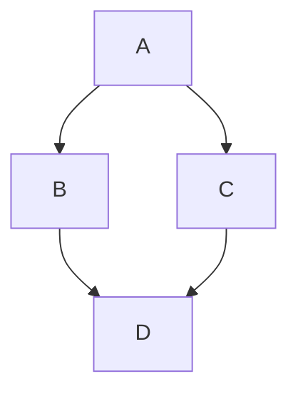

<style
  type="text/css">
h1 {color:red;}

p {color:blue;}
</style>
<div align="left"> <a href="https://pypi.org/project/syft/"></a> <a href="https://pypi.org/project/syft/"></a> <a href="https://github.com/OpenMined/PySyft/actions/workflows/syft-version_tests.yml"></a>
 <a href="https://github.com/OpenMined/PySyft/actions/workflows/nightlies-run.yml"></a>
<a href="https://openmined.slack.com/messages/support"></a><br /><br /></div>
<h1>OpenMined: Syft</h1>

Remote Data Science - Code for `computing on data`, you `do not own` and `cannot see`

<div align="left">
    
</div>

<br />

# Ouickstart

<p align="left"></p>

```bash
# install our CLI tool
$ pip install hagrid

# launch a jupyter notebook tutorial
$ hagrid quickstart
```

# What is Syft?


`Syft` allows you to perform `private` and `secure` Deep Learning by making it possible for you to answer a question using data owned by someone else `without` ever `seeing` or acquiring a `copy` of that data. We call this process `Remote Data Science`.

This paradigm shift means, for a wide variety of `domains` across society the current `tradeoffs` between the `benefits` (innovation, insights, scientific discovery) of sharing information with someone and the `risks` that they might `misuse` it (privacy invasion, IP theft, blackmail) no longer hold.

For example, `Syft` can improve your product based on customers' `private data` without them needing to disclose their sensitive information. Researchers will make medical `advances` `without` patients `disclosing` medical `information`.

It also means `1000x more data` in every domain. Syft achieves this using [Federated Learning](https://ai.googleblog.com/2017/04/federated-learning-collaborative.html) and [Encrypted Computation](https://en.wikipedia.org/wiki/Homomorphic_encryption) and is currently under active development.

# I want to \_\_\_\_ with Syft

<table>
<tr>
<th align="center">

<p>👩🏽‍🔬 Data Scientist</p>
</th>
<th align="center">

<p>👨🏻‍💼 Data Owner</p>
</th>
<th align="center">

<p>👷🏿 Data Engineer</p>
</th>
</tr>
<tr>
<td valign="top">
<!-- REMOVE THE BACKSLASHES -->

- dot point 1
- dot point 1
- dot point 1
- dot point 1

</td>
<td valign="top">
<!-- REMOVE THE BACKSLASHES -->

- dot point 1
- dot point 1
- dot point 1
- dot point 1

</td>
<td valign="top">
<!-- REMOVE THE BACKSLASHES -->

- dot point 1
- dot point 1
- dot point 1
- dot point 1

</td>
</tr>
</table>

# Important Terms

<table>
<tr>
<th align="center">

<p>👨🏻‍💼 Data Owners</p>
</th>
<th align="center">

<p>👩🏽‍🔬 Data Scientists</p>
</th>
</tr>
<tr>
<td valign="top">
<!-- REMOVE THE BACKSLASHES -->

Provide `datasets` which they would like to make available for `study` by an `outside party` they may or may not `fully trust` has good intentions.

</td>
<td valign="top">
<!-- REMOVE THE BACKSLASHES -->

Are end `users` who desire to perform computations or `answer` a specific `question` using `data` owned by `someone else`. They can see a list of `datasets` hosted on the `Domains` and can request to get the results.

</td>
</tr>
<tr>
<th align="center">

<p>🏰 Domain Server</p>
</th>
<th align="center">

<p>🔗 Network Server</p>
</th>
</tr>
<tr>
<td valign="top">
<!-- REMOVE THE BACKSLASHES -->

Manages the `remote study` of the data by a `Data Scientist` and allows the `Data Owner` to manage the `data` and control the `privacy guarantees` of the subjects under study. It also acts as a `gatekeeper` for the `Data Scientist's` access to the data to compute and experiment with the results.

</td>
<td valign="top">
<!-- REMOVE THE BACKSLASHES -->

Provides services to a group of `Data Owners` and `Data Scientists`, such as dataset `search` and bulk `project approval` (legal / technical) to participate in a project. A network server acts as a bridge between it's members (`Domains`) and their subscribers (`Data Scientists`) and can provide access to a collection of `domains` at once.</td>

</tr>
<tr>
</table>

The steps performed by the respective personas are shown below:

<div>
    
</div>

# Deployment

'_List with all platforms that are clickable and lead to their respective separate pages_'



Syft provides multiple easy and straightforward options to deploy all of its stacks.

1. [Deploy to Single VM]()
1. [Deploy to Cloud]()
1. [Deploy to Kubernetes]()

# Call for Contributors

'_Link to Resources, Contributing, Padawan program, Courses, Documentation, Blogs and slack_'

OpenMined and Syft appreciates all contributors, and if you would like to fix a bug or suggest a new feature, please see our [Contribution guidelines](https://openmined.github.io/PySyft/developer_guide/index.html).

If you are still looking for some help in understanding Syft, learn more about the Syft library using the below resources:

1. [Study Resources](https://openmined.github.io/PySyft/resources/index.html)
1. [Padawan Program](https://www.youtube.com/watch?v=SWekBc0wnxY&list=PLriDu8kWH9JRXWlCib9ufqSJqK1qhmSrB&index=2)
1. [Syft Courses](https://courses.openmined.org/courses)
1. [Official Documentation](https://openmined.github.io/PySyft/index.html)
1. [Blogs](https://blog.openmined.org/)

Nevertheless, introduce yourself to our continually growing [Slack](https://communityinviter.com/apps/openmined/openmined/) Community with 14,500+ members, and one of us will be happy to help you with your questions.

# Disclaimer

The software is in Beta. If you find yourself stuck at some point, don't hesitate to contact us at #support [Slack](https://communityinviter.com/apps/openmined/openmined/) channel, where we have an active community of amazing people who are always ready to help you.

# Organisational Contributors

'_Thank the organisations that have been contributing in terms of developers but w way smaller logos_'

Syft exists because of all the great people who contributed to this project. We are very grateful for contributions to Syft and Grid from the following organizations!

  <br>
  
  </br>

# License

[Apache License 2.0](https://github.com/OpenMined/PySyft/blob/main/packages/syft/LICENSE)
